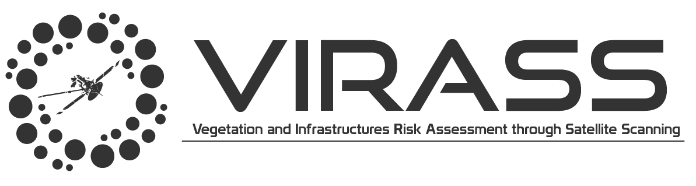
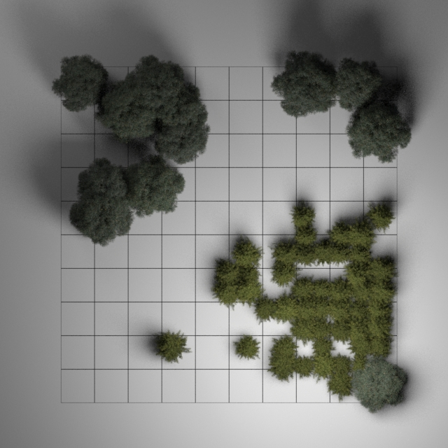
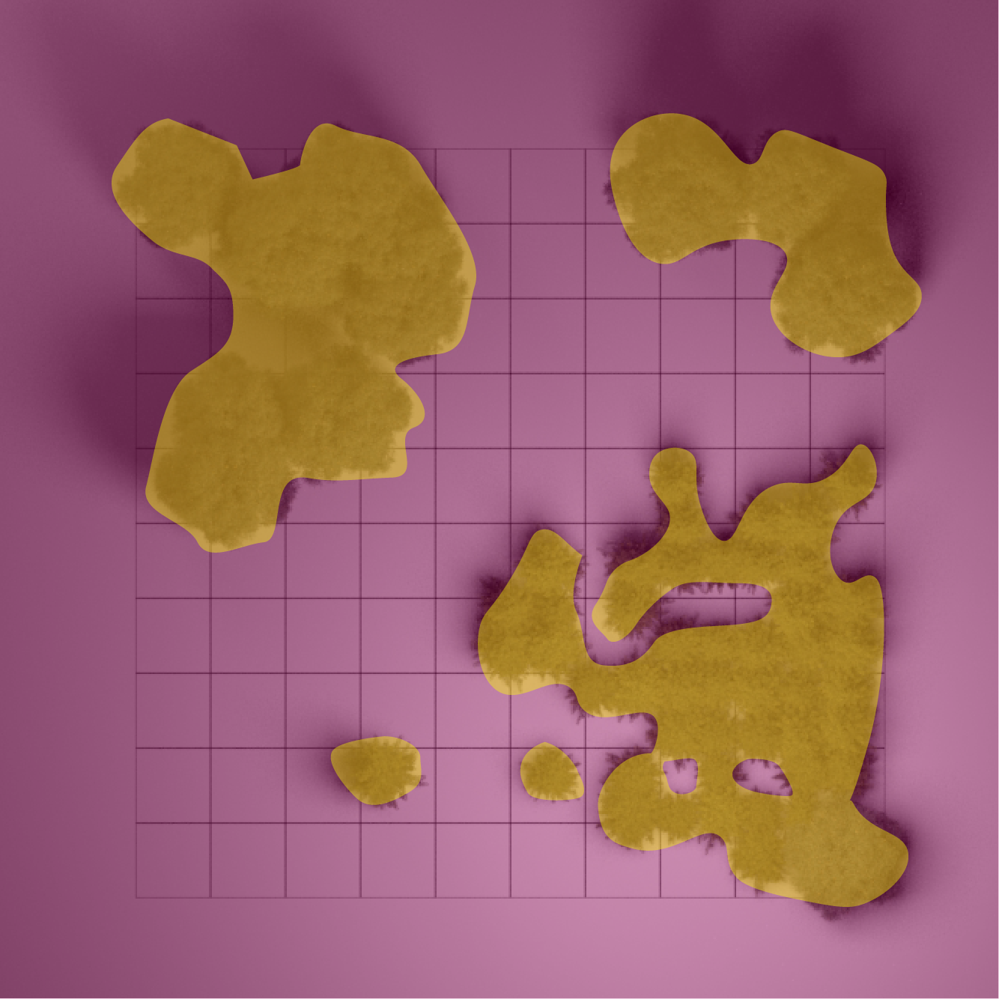
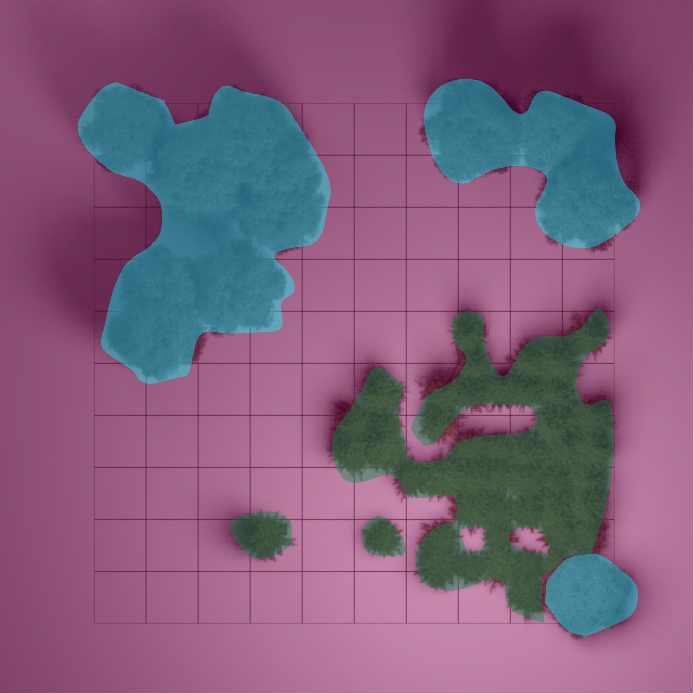
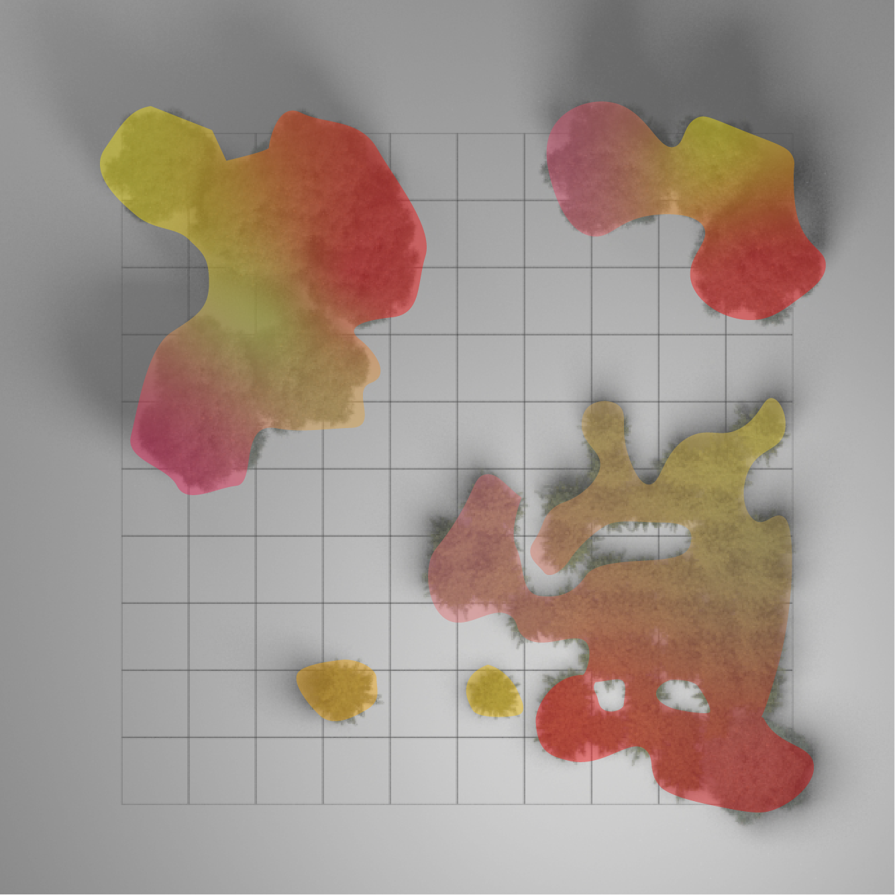
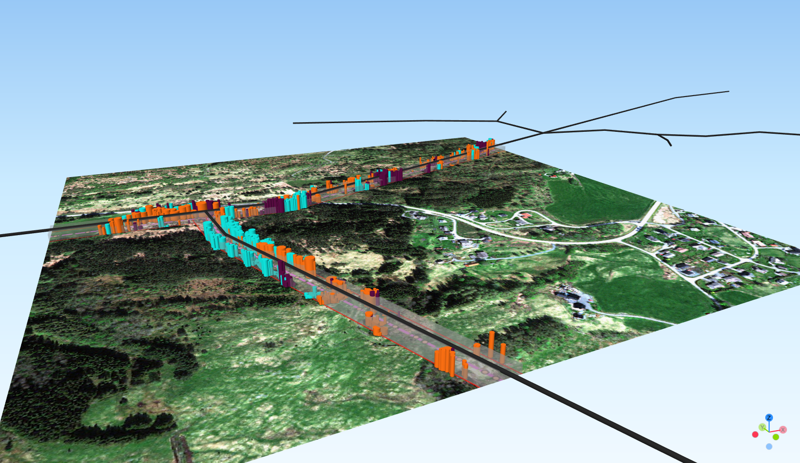

# VIRASS

[](https://github.com/weecology/DeepForest/actions/workflows/Conda-app.yml)
[](http://deepforest.readthedocs.io/en/latest/?badge=latest)
[](https://pypi.python.org/pypi/DeepForest)
[](https://doi.org/10.5281/zenodo.2538143)




VIRASS (Vegetation and Infrastructures Risk Assessment through Satellite Scanning) is a Python package for assessing vegetation-related risk along infrastructure lines. VIRASS implements sub-modules such as
- vegetation segmentation
- tree species classification
- height estimation
- individual tree crown delineation
- tree inventory generation
- risk calculations 
- and utilities for dealing with geo-spatial data.

It is built on top of standard geo-libraries such as rasterio, geopandas, and shapely. The computer vision and machine learning modules are instead built on top of tensorflow, keras and skimage.


## Motivation

 Vegetation along the infrastructure lines is one of the major causes of outages, especially along roadways and power lines. Trees can fall after strong winds, disrupting the lines and blocking the roads. If a tree is growing too close to the power line, it might also trigger wildfires.
 Traditional approaches based on visual inspections are extremely time-consuming and very costly.
 
 *VIRASS* aims to ease the process of infrastructure monitoring, providing tools to characterize vegetation and calculate threat posing to nearby infrastructure.
  


# Installation

VIRASS can be install using pip (*TODO*)

```
pip install virass
```

# Basic usage

VIRASS is designed to be very easy to use, implementing many functions "under the curtains". 
The code snippet below provides the code to segment a satellite image and detect trees, with few lines of code.

```Python
import VIRASS as ges
# Initialize a tree segmenter
tree_segmenter = ges.tree_segmentation.TreeSegmenter(config_file = "tree_segmenter_config.yaml")

# Load a satellite image
SAT_image_path = "/.../image.tif"
SAT_image_input, meta_data = ges.io.open_geoTiFF(SAT_image_path)

# Build the model (no need to train it if is already provided in the configuration file)
tree_segmenter.build_model()

# Predict the tree mask
tree_map_predicted = tree_segmenter.generate_tree_map(SAT_image_input)
```


# Try demos using Jupyter Notebook

The following Jupyter notebooks show how to use VIRASS for particular tasks, exlpaining step by step the functions. 


## Vegetation segmentation 

<p float="left">


</p>

[Code](/Block_tree_segmentation.ipynb)

## Tree species classification

<p float="left">


</p>

[Code](/Block_tree_species_classification.ipynb)


## 3D modeler

<p float="left">


</p>

[Code]()


## Risk calculation



[Code]()


 
